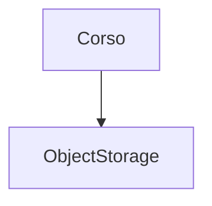

# Repositories and configuration

## Object storage configuration

Corso stores all backup data in an object storage system. Corso supports Amazon Web
Services (AWS) S3, Google Cloud Storage (GCS), Azure Blob, and S3-compatible systems.



### Amazon S3 and S3-compatible systems

Corso needs the following permissions for AWS S3 and S3-compatible object storage systems:

```json
{
    "Version": "2012-10-17",
    "Statement": [
        {
            "Effect": "Allow",
            "Action": [
                "s3:PutObject",
                "s3:GetObject",
                "s3:ListBucket",
                "s3:DeleteObject",
                "s3:GetBucketLocation",
            ],
            "Resource": [
                "arn:aws:s3:::${BUCKET_NAME}",
                "arn:aws:s3:::${BUCKET_NAME}/*"
            ]
        }
    ]
}
```
