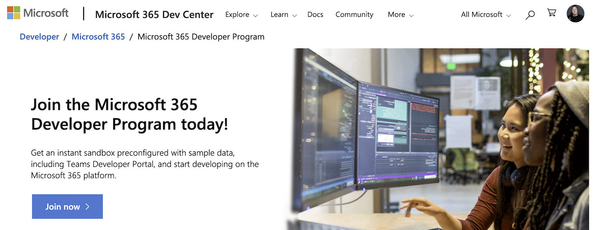
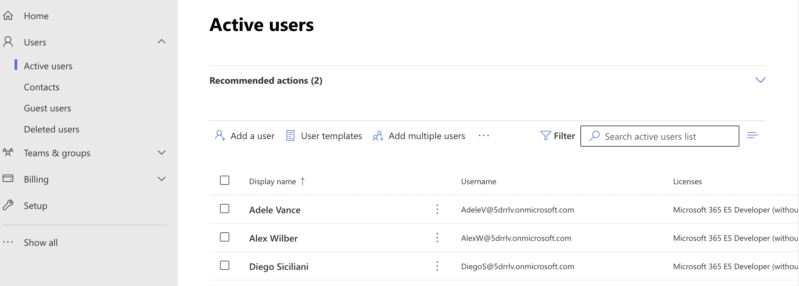

When trying to do this myself I found some of the documentation out of date,
so this is a quick guide to setting up a sandbox domain for Microsoft 365 development.

## Why would you want to do this?

I personally needed this for recording a screencast of the process to install the free CLI tool Corso.
While recording myself going through permission settings in M365,
I didn’t want to unintentionally reveal PII for my team members or other sensitive data.

Another reason if you’re looking to level up both your skills,
you may want to experiment with being the admin in your own space,
rather than bumping into other users on a production domain. It’s also a good step to experiment with [owning your own identity](https://corsobackup.io/blog/your-own-backups/).

Another great reason is for developing an M365 app, so that programmatic updates to your domain can’t accidentally destroy anything important.

## 1) Join the Microsoft 365 Developer Program

To get access to the free hosting required for your sandbox domain,
you’ll need to [join the M365 Developer Program](https://developer.microsoft.com/en-us/microsoft-365/dev-program).
This process is quite straightforward and fairly foolproof.

> Note that when you go to set this up the first time, you may find that your Microsoft Account isn’t fully set up.
> For example on my account I didn’t have a full name set on my profile. You’ll be prompted to add this info if needed

You’ll also be asked for the following info:

- Contact Email
- Country/Region
- Company

As far as I know, no answers to these questions will disqualify you, but let me know if any answers kick you out of the process!

Notably, one piece of extant documentation implies you need a Visual Studio subscription to join the Developer Program,
but, currently, it looks like anyone with a Microsoft account, even just a personal account, can get access.

## 2) create an instant sandbox

After joining the developer program and signing in to the developer dashboard, you’ll be prompted to set up a sandbox

While you can configure a custom sandbox domain to control the exact components installed,
for the use cases mentioned above an instant sandbox will work just fine.

The pre-made sandbox also comes pre-populated with data like user accounts
(you can decide during setup if you want to set all the passwords for these accounts to be the same as the admin)

*your sandbox comes pre-populated with user accounts*

## 3) Limitations of the sandbox

Notably, by default, there won’t be the following data in your sandbox:

- emails
- teams chat history
- calendar events

Your sandbox includes a free Microsoft 365 E5 developer sandbox subscription with 25 user licenses, and that’s awesome,
but it doesn’t work like a production instance.

Remember that you want to set up your sandbox when you’re ready to use it.
The data is persistent but it’s wiped after 90 days.

Also, you can’t just do whatever you want with this instance, it’s for development purposes (coding solutions) only.
Commercial transactions, including purchasing paid services, are not supported.

## 4) Next steps

To learn more about populating your domain with dummy data, see
[developer sandbox demo data](https://learn.microsoft.com/en-us/office/developer-program/install-sample-packs)
to create users, email, calendar events, and other dummy data for testing.

And if you want one more thing to try out with a sandbox domain, check out [Corso](http://corsobackup.io),
a free and open-source backup tool. The sandbox is a great place to try it out!
