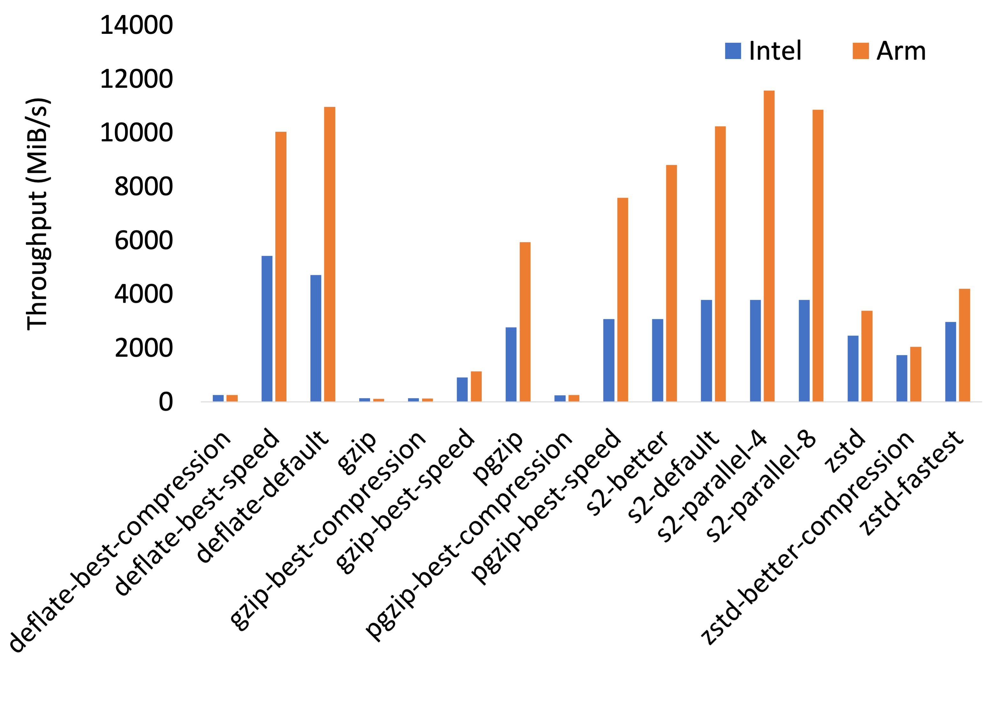
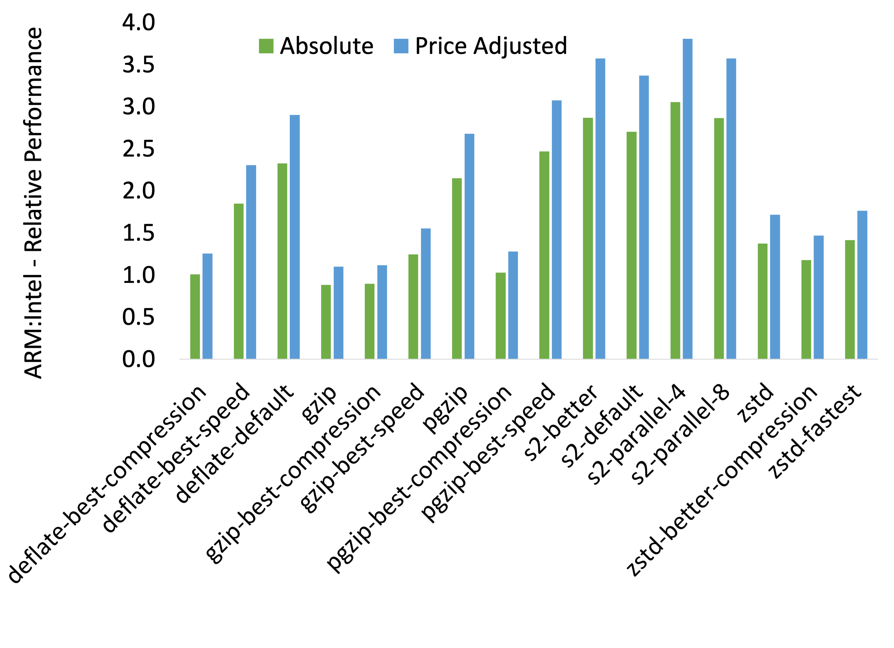
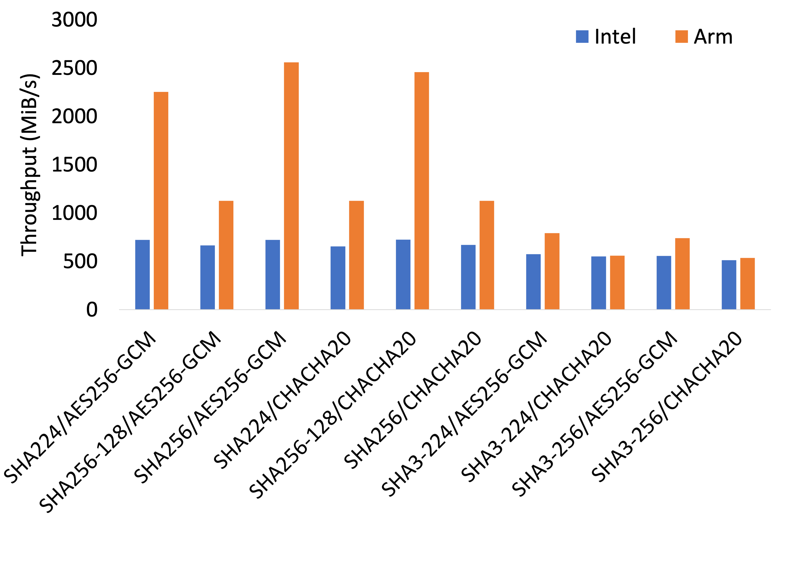

This article benchmarks the performance of the compute-intensive
components found in modern backup applications on Intel and ARM
(Graviton) architectures. The results around performance and
cost-efficiency are illuminating as we expected most of
third-party hashing and encryption libraries to be primarily optimized
for Intel and not ARM.

<!-- truncate -->

## Why we care

To improve security and efficiency (storage used, network transfers)
as well as to reduce cost, Corso, our free open-source backup tool for
Microsoft 365, uses encryption and deduplication under the hood. From
a security perspective, this ensures that no third party, including
your cloud provider, can ever read your data. From an efficiency
perspective, no duplicate copies of your data are stored or even
transferred to the cloud provider. Therefore, if you accidentally have
duplicated files in OneDrive or the same file or email shows up in
multiple backups, only one copy of the data will be stored in the
cloud and will only be transferred once.

However, given the large amounts of data that
[Corso](http://corsobackup.io) might transfer, we wanted to look at
both performance and cost-efficiency of running Corso on ARM
(Graviton) vs. Intel and the results are quite striking!

The takeaways from the benchmarking include:

- Overall, ARM outperforms Intel for data-intensive tasks required by
  backup applications and the difference can be as high as **350%**.

- ARM is a much better fit for data-intensive processing that can be
  parallelized than for single-thread workloads

- The lower cost of ARM further amplify its advantages if you are
  focused of delivering more throughput for every dollar spent

- While ARM might not be ideal for some parts of the data-intensive
  deduplication pipeline, the overall win is higher

*While our benchmarking is extremely suggestive about the efficiency
 of ARM for these specific tasks, if compute time is a significant
 part of your spend we encourage you to do your own benchmarking. If
 you get different results we’d love to hear about it! [Join our
 Discord](https://discord.gg/63DTTSnuhT) to continue the conversation*

## Experimental setup

To ensure that our results would be as comparable as possible, we
picked an Intel and ARM VM running in AWS in us-east-1. These are the
configurations of the systems:

| Architecture | AWS Instance Type  | vCPUs | Memory (GiB) | Cost ($/hour) |
| --- | --- | --- | --- | --- |
| Intel | m6i.xlarge | 4 | 16 | $0.192 |
| ARM | m6g.xlarge | 4 | 16 | $0.154 |

## Experiment

In Corso, we use [Kopia](https://kopia.io/) as our data processing
engine. It first split the data to divide larger files into smaller
chunks for efficient deduplication. That split data is then
deduplicated through the use of cryptographically strong hashing
algorithms, compressed, and then encrypted.

Based on this data pipeline, we split our measurements into 5
different parts to microbenchmark the different parts of the above
process. For each of the below microbenchmarks, we also varied
internal benchmark parallelism between 1, 4, and 8 parallel
goroutines.

- Splitting: Buzhash vs. Rabin-Karp algorithms
- Compression: Different variants of deflate, S2, lz4, zstd, gzip, and pgzip
- Hashing: Different BLAKE and HMAC-SHA variants
- Encryption: AES256-GCM and ChaCha20-Poly1305
- Hashing + Encryption: Combination of the above Encryption and Hashing algorithms

## ARM vs. Intel performance results

Given the large number of results collected (there are 372 distinct
performance data points!), we will only be presenting a subset of the
results collected for the splitting, compression, and combined hashing
and encryption microbenchmarks.

Within these results, we will focus on the numbers with parallelism
set to 8 and will focus on throughput numbers (higher is better)
measured in MiB/s. For easier visualization, we also present the
relative performance where we compare the throughput of ARM
vs. Intel. For a more price-accurate comparison, we also present the
price-adjusted relative performance where we see how many more MiB/s
we can process for the same dollar.

While there is color on some of the results not presented but give us
a shout on [Discord](https://discord.gg/63DTTSnuhT) if you want to see
the raw data.

### Splitter

Let’s first look at splitting, a critical part of data deduplication,
that uses rolling-hash functions. While there is a lot more
information available elsewhere, a rolling hash is a type of hash
function that operates on a sliding window of data, allowing it to
efficiently compute the hash value for a given chunk of data without
having to process the entire dataset. This is useful in deduplication
because it allows Corso and Kopia to quickly compare the hash values
of different chunks of identical data, even if they're not the same
size or don't start at the same point in the dataset.

The size of the blocks and the algorithm used to divide the dataset
are important considerations in deduplication, as they can affect the
speed and efficiency of deduplication. For these results we compare
the performance of Buzhash vs. the Rabin-Karp algorithm with block
sizes of 1MiB, 2MiB. 4MiB, and 8MiB.

As we can see in the results, Buzhash is faster than Rabin-Karp for
all block sizes. Further, for Buzhash, ARM is 150% faster than Intel
and 190% on a per-dollar price-adjusted basis.

While not presented here, it should be noted that with parallelism of
1, splitting on ARM was only 60% and 80% of Intel’s performance for
Buzhash and Rabin-Karp respectively. This does show that ARM might be
a bad choice for single-threaded applications.

### Compression

For backups, we're limited to using lossless compression algorithms
where there is no room for data degradation. The compression algorithm
selection is driven by various tradeoffs such as their effectiveness
at reducing data size, computational efficiency, and the speed. Some
algorithms may be effective at reducing data size but may require
a lot of computational resources while others may be less effective at
reducing the size of a file but may be much faster to execute. For
this experiment, the compression algorithms were run on an large file
(100MiB) that was generated from random data and was therefore not
compressible.

When we look at absolute and relative performance results above, we
see that the absolute performance of various compression algorithms on
ARM is almost equivalent (90%+) of Intel in the worst case (`gzip`)
and up to 300% better (`s2-parallel-4`). The difference is even
starker on a price-adjusted basis where ARM is delivering a 380%
improvement over Intel on a per-dollar basis.

While not presented here, it should again be noted that with
parallelism of 1, compression on ARM was slower for some compression
algorithms (`gzip`, `zstd`) and some variants
(`deflate-best-compression`, `pgzip-best-compression`). This once
again highlights the power of ARM when used in multi-thread
applications and the need to benchmark for your workload.

### Hashing + encryption

Two critical components are left to complete the deduplication
data path in Corso and Kopia. A unique key (hash) for the data needs
to be generated for comparing identical data chunks and this is accomplished via
either the `BLAKE` hashing algorithm or a `SHA` hashing algorithm with
an HMAC. HMAC, or Keyed-Hash Message Authentication Code, uses a
cryptographic hash function in combination with a secret key. This key
is used to authenticate the data being hashed and can be used later to
ensure that it hasn't been tampered with. The data is then also
encrypted using an encryption algorithm (for example, `AES256-GCM` or
`ChaCha20-Poly1305`).

For this experiment, we benchmarked the combination of different
hashing and encryption algorithms but only present the `SHA` variant
HMAC results here. All of the `BLAKE` variants on ARM significantly
underperformed Intel (between 20--80% of Intel’s performance) and we
believe that this is because the [underlying
library](https://github.com/zeebo/blake3) being used has no
ARM-specific optimizations but it does have optimizations for Intel
platforms with AVX2/SSE4.1.

For the below results, the first part of the chart label is the
hashing algorithm used (HMAC is used with every SHA variant) while the
second part is the encryption algorithm.

As seen above, with a parallelism of 8, hashing and encryption on ARM
never underperforms Intel on an absolute basis and always outperforms
on a price-adjusted basis. In particular, ARM can significantly
outperform Intel processors by 350% on an absolute basis and by up to
440% on a price-adjusted basis.

When we teased apart the hashing and encryption results, we noticed
that hashing, for the `HMAC-SHA-256` variants were up to 700%
(absolute)/870% (price adjusted) faster on ARM. In contrast,
`AES-256`encryption throughput on ARM is only 90% that of Intel’s at a
parallelism of 8 but, price adjusted, it can process 120% more data
for the same cost while `ChaCha20-Poly1305`'s performance is between
40% (absolute) and 50% (price adjusted) of Intel’s. However, given
that relatively more work performed in hashing, the difference
disappears when the combined work is taken into account.

While not presented here, it should again be noted that with
parallelism of 1, hashing and encryption on ARM was slower when using
`SHA3` HMAC variants for hashing but ARM starts to outperform with
parallelism of 4 and above. This once again highlights the
applicability of ARM to multi-threaded applications.

## Conclusion

The above results show how exciting ARM is as an architecture for us
data-processing nerds because of the performance and cost
optimizations possible. The improvement is a result of the hardware
acceleration available on the ARM platform we used for benchmarking
(AWS Graviton) and the optimization found in the libraries used in our
product. While these things will constantly shift, we're excited
about the advances and the benefits for users of backup software.

If you have questions, want access to raw data, or want to talk about
about future benchmarking, join us on
[Discord](https://discord.gg/63DTTSnuhT) or follow us on
[Twitter](https://twitter.com/CorsoBackup) to get the conversation
started. We look forward to hearing from you!
