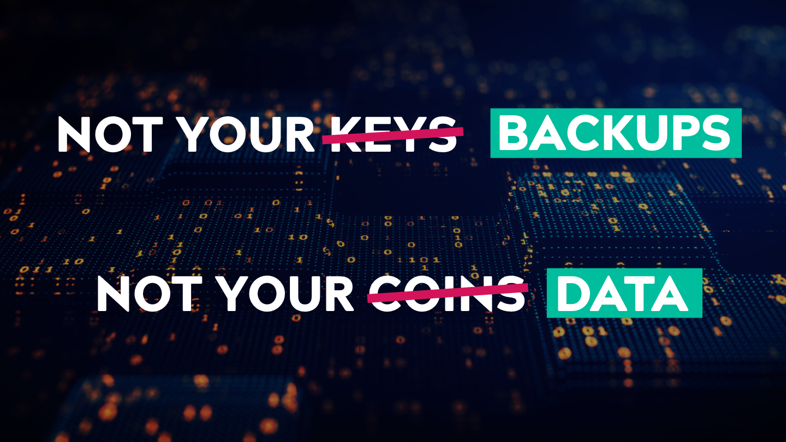

Rackspace is having a rough few days.

## The story thus far

Rackspace Technology announced on December 7th that, six days after
suffering a ransomware attack, they're still unable to determine when
normal email service will be restored to the thousands of hosted
Microsoft Exchange customers. They asked for customers' patience and
provided temporary email fixes as they continue to investigate the
attack that began late last week and has caused ongoing disruptions.

Service interruptions started on December 5th with no end in sight.

<!-- truncate -->

“While the investigation is ongoing and in its early stages, at this
time, we're unable to provide any timeline or expectations for
restoration to the Hosted Exchange environment,” said an official
forum post last Wednesday, “we're working to provide customers with
archives of inboxes where available.”

Rackspace, which has been stressing many administrators out with its
lack of transparency and accessibility during the outage crisis, is
doing all it can to fix the disrupted service, including throwing as
many employees at the problem as possible. However, they remain
tight-lipped about what customer info might have been accessed.

## No end in sight

Rackspace has confirmed the attack was ransomware, and in the meantime
it’s recommending users shift to Microsoft 365, saying: “we're
working diligently to meet our customers' needs regarding access to
email and email forwarding. As noted in our recent updates, we've
arranged for all Hosted Exchange customers to have access to Microsoft
365”

[Read the full post from Rackspace
here.](https://status.apps.rackspace.com/index/viewincidents?service=6&start=1670216400)

The company doesn’t want to release full details of the incident,
saying that it’s under active investigation, but it can be
difficult to feel secure not knowing any details of the incursion.

## What went wrong

Rackspace is a large company, with 6,000 employees and over 3 billion
in annual revenue. As such this situation is a surprising one. The
company isn't sharing the details of the breach, but the issue isn't
that their security was breached, that production data stores were
compromised, or that this affected users' access. The issue is that
Rackspace has no plan for recovery (as far as customers are concerned,
an inadequate plan, as seen in [the Atlassian data
outage](https://www.atlassian.com/engineering/post-incident-review-april-2022-outage),
is the same thing as no plan). Demanding perfection isn't a path to
resilience.

Rackspace has been around for a long time and effective operations are
really their main selling point, as such they should have had an
effective:

- Backup system Disaster Recovery Plan Ransomware Plan

Notably, these three plans aren't identical, but they should all be in
place to ensure that the company can recover from any incident.

Backup systems are essential for ensuring data is safe and secure, as
well as providing a way to restore lost or corrupted files. Disaster
Recovery Plans provide guidance on how to respond when an unexpected
event occurs, such as a natural disaster or cyberattack. Ransomware
plans help protect against malicious actors who may attempt to hold
your data hostage by encrypting it until you pay them money.

As the saying goes, a backup is only as good as your recovery.
We believe that Rackspace likely had runbooks and backup and recovery
plans for the above but, as seen in the [Gitlab data loss
incident](https://about.gitlab.com/blog/2017/02/10/postmortem-of-database-outage-of-january-31/)
a few years ago, without frequent testing and verification, these
plans aren’t meaningful. These plans need to be updated to reflect the
constant security attacks we find ourselves under these days. Backups,
in particular, need to be hardened and made immutable to prevent
ransomware from modifying or deleting them.

It should also be stressed that a backup is meaningless if it can't
be restored in a short period of time. If an organization needs
multiple weeks to restore something as critical to a business as email
and data access, that's equivalent to a total data loss and can be a
company-ending event for the organization’s customers.

Rackspace needs to take steps immediately towards verifying and
testing these plans and implementing them into their operations so
that they can better prepare themselves for future incidents like this
one. They need to invest in better security measures such as
firewalls, antivirus software, intrusion detection systems (IDS), and
other tools designed specifically with ransomware protection in mind;
create detailed backup procedures; develop comprehensive recovery
strategies; train staff on proper response protocols; and regularly
test their system's resilience against potential threats.

That said, beyond pointing fingers, what can all of us learn from this?

## Do you *really* control your data?

This question, whether your data is really yours, always prompts
certain members of the chattering classes to say ‘this is why the
cloud was a mistake’ and recommend some kind of retrograde abandonment
of current technology. Such types won’t be happy until the first year
of every startup’s life is spent waiting for backordered RAM. To be
clear: we'ren’t recommending that you abandon cloud data storage and
hosting services.

However, key data ownership principles do dictate that you can't
fully trust any single public cloud tool with everything.

## “Not your keys, not your coins” ➡️ “Not your backups, not your data”

The phrase “Not your keys, not your coins” is a popular saying in the
cryptocurrency world. It's a reminder to users that if they don't
have control of their private keys, they don't have control of their
coins. Private keys are a string of numbers and letters that are used
to access a cryptocurrency wallet. They're the only way to access the
funds stored in the wallet, and if someone else has access to the
private keys, they can access the funds.

This principle applies to cloud data storage as well: if you have no
way of exporting all your data, and no backups independent from your
cloud provider, you don’t really ‘own’ your data and will be at the
mercy of whatever vagaries beset that provider.

Incidents like this one with Rackspace aren’t all that common, and
they shouldn’t be, but they do happen. When they do, you don’t want to
be at the mercy of the primary provider’s backup and restore SLAs (or
lack thereof). Instead, we recommend exploring some straightforward
ways to protect yourself by owning your own backups. If you control
your own backups, you also control where you can restore it for
temporary access and thereby sidestepping the failed infrastructure,
the latency of restores to prevent being at the back of the line in
the restore queue, the ability to permanently move your data to a
different infrastructure provider to reduce lock-in with unreliable
vendors, and more!

## Our recommendations

### Understand your provider’s responsibility model

As the data owner or IT lead, you should:

1. Research the cloud provider's Service Level Agreement (SLA) to
understand the responsibilities and liabilities associated with
service delivery (for example, see [Microsoft’s shared responsibility
model](https://learn.microsoft.com/en-us/azure/security/fundamentals/shared-responsibility)).
2. If your cloud or service provider doesn’t have a well-defined risk
model and you don’t have other reasonable options, ask as many
questions as possible during the on-boarding process in order to gain
a full understanding of your responsibilities and any other
obligations that need to be met.  3. Familiarize yourself with not
just your company’s backup and retention policies but also industry
standards and regulations related to data security, privacy, and
compliance with applicable laws that may apply when utilizing cloud
services from your particular provider.

### Have you own backups on an independent platform

While we disagree with the [3–2–1 backup
rule](https://www.uschamber.com/co/run/technology/3-2-1-backup-rule)
in today’s cloud environments (more in a different blog post), you
shouldn't store your backups on the same system or infrastructure as
your primary data. Otherwise, you will likely lose access, often
permanently, to your backups when you need them the most.

However, you also don’t need to buy on-prem backup appliances, build a
bespoke storage system, or jump through any hoops to create an
independent backup copy. Find a modern backup tool that optimizes for
usability and supports cloud object storage (S3, Azure Blob,
etc.). These tools should support deduplication, compression, and
encryption to reduce network and storage costs and you should pick a
cold storage tier to even further reduce any associated backup
expenses.

### Test and verify

Taking backups isn’t enough, you’ve got to try using them, even if
only as a test. On a frequent basis, ensure that your backups are
definitely encrypted with keys that you control, use your backup tool
can verify that the data hasn’t been corrupted (using cryptographic
hashing), and perform test restores into sandbox
environments. Ideally, this should be automated with alerts in case of
failures.

On a semi-frequent basis, do test restores of varying subsets of your
data and measure how long it takes to restore it, where the
bottlenecks might be, and to see how long it would take to recover a
meaningful amount of data from a major outage. Does that meet your
SLA? Note that this often doesn’t mean restoring all data immediately
but a subset of the most recently accessed and modified data to get
things back up and running.

## Backing up Microsoft 365

We would be remiss if we didn’t concretely tie our recommendations
back to where we started, a large email outage at Rackspace. Rackspace
has recommended that all customers move to Microsoft 365 and so, we
will focus on that. Microsoft’s architecture should be a lot more
stable but the customer’s responsibility hasn’t gone away and
Microsoft [
highlights](https://learn.microsoft.com/en-us/azure/security/fundamentals/shared-responsibility)
that on their website when they say that they're responsible for the
infrastructure but the customer is responsible for their data.

To help with your portion of the responsibility, we recently release
[Corso](/), a free, secure, and open-source tool that protects your
Microsoft 365 data, at low cost, by securely and efficiently backing
up all business-critical data to object storage.

You can get started with Corso in [just a few
minutes](https://corsobackup.io/docs/quickstart) and you will be able
to move your Microsoft 365 emails and data to your choice of object
storage provider and location. Not only will Corso compress and
deduplicated your data, it will also encrypt it with your keys. Corso
also uses internal checksums to verify the integrity of your data.

It’s also possible to quickly verify and test your backups with
Corso. You can restore user data in sandbox environments and accounts
and perform filtered restores to just bring back subsets of data. Give
it a try and [let us know what you
think](https://discord.gg/63DTTSnuhT)!
