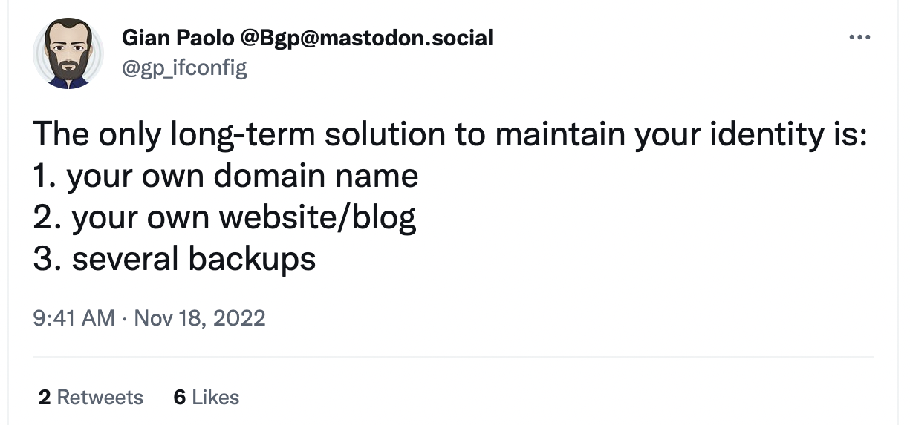
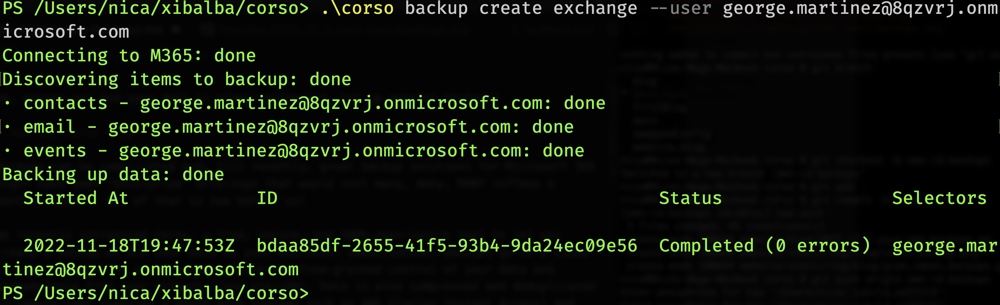

I recently saw a tweet that really spoke to me:

Gian was really addressing the chaotic situation with Twitter, but it feels much more broadly applicable in today’s climate.
Given the increased role of automation in flagging “bad” accounts,
 there is now an ever-growing list of examples where imperfect AI-based systems misclassify perfectly legitimate accounts
 as bad. With no human-based recourse with most large companies, this has led to disastrous situations where
 email account suspensions lead to lost accessing to other services that you have used your entire life
 (due to SSO via your email account), AdWords account suspensions lead to a small business unable to advertise, or a
 flagged application account leads to published applications being automatically withdrawn from app stores.

Thankfully, the growth of easy-to-use SaaS services now allow you to, for the price of a coffee a month,
control and maintain not just your identity without risk but also all your personal and,
for all you entrepreneurs, business data too. There’s a happy state, for individuals and teams, where you feel fully in
control of your own identity. This makes you more resilient to systemic failures and changes in one platform’s policy.
How do we achieve this ownership nirvana? The pieces are simple:

* Buy your own domain: Right now, `.me` is available for $3/year and `.online` is available for $0.99/year.

* Pick someone to host your email with the above domain: We highly recommend [Microsoft 365 Business for $6 /month](https://www.microsoft.com/en-us/microsoft-365/business).

* Microsoft Office applications that you know and love, 1TB of file storage, unlimited video meetings,
and more: FREE with your Microsoft 365 subscription.

* Your own blog at your own domain: Static hosting with a global CDN like AWS CloudFront will be < $1/month!

OK, so the above might cost the equivalent of two coffees a month (or way less than an
[expensive San Francisco coffee](https://www.nbcbayarea.com/news/local/world-most-expensive-coffee-elida-geisha-natural-klatch-san-francisco/190823/))
but you are suddenly in control of your identity, and this is not even tied to Microsoft 365 (more on that below!) even
though you are using it at this time. This is an amazing cost to value ratio given how important our data is.

## Securing your own data means controlling your own backups

Now, you might believe that your identity is tied to Microsoft’s control of your account but that is not true.
Given that you own your domain, you can now take your data and email with you to any other provider.
Having moved between Google Suite and Microsoft 365 in the past, this can be made seamless.

That said, if we go back to Gian’s tweet at the beginning of this article,
there is one big issue that we failed to consider: backups! You want to back up your data in an independent location
(cloud storage, your server under your desk, etc.) for many really important reasons: to protect against ransomware,
to give you independent access to your data (email, files, messages) if the cloud provider locks you out overnight,
to be able to port your data over if a cloud provider’s
policies change seemingly overnight, or even to just respect
[Microsoft’s shared responsibility model](https://learn.microsoft.com/en-us/azure/security/fundamentals/shared-responsibility)
where you are responsible for your data’s safety and Microsoft only promises to take care of the infrastructure.

So, ensure you and your data is always protected, set up regular backups!

## How can Corso help?

Backups can be complicated and, till recently, great backup solutions for Microsoft 365 might have been “enterprise”
offerings that would cost many, many, MANY coffees a month. However, all of that is now behind us!

We recently introduced Corso, a free, secure, and 100% open-source tool to let you create a backup of all your data in
your Microsoft subscription. Backups go to a cloud storage provider of your choice, giving you fine-grained control of
your data and independence from your primary cloud provider. Data is also compressed and deduplicated to reduce cost
(pennies a month with systems such as AWS Glacier Instant Access) and encrypted with user-provided keys so that no one
can see your data and that it is safe against hackers and ransomware.

Corso is available now, and we’d love to hear your thoughts! Download it, give it a try, and join us on Discord to let
us know what you think.
