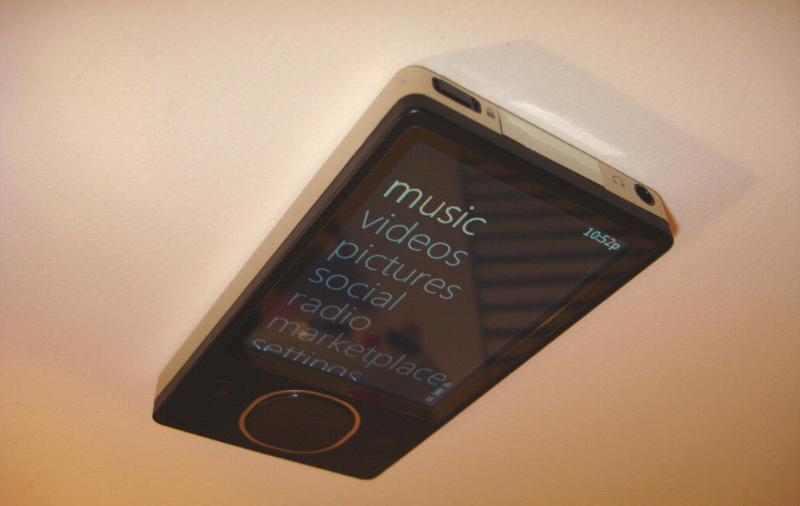
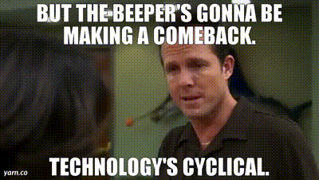
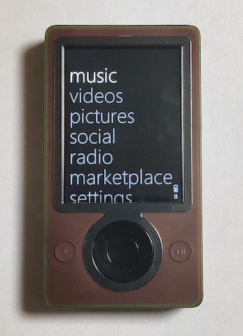
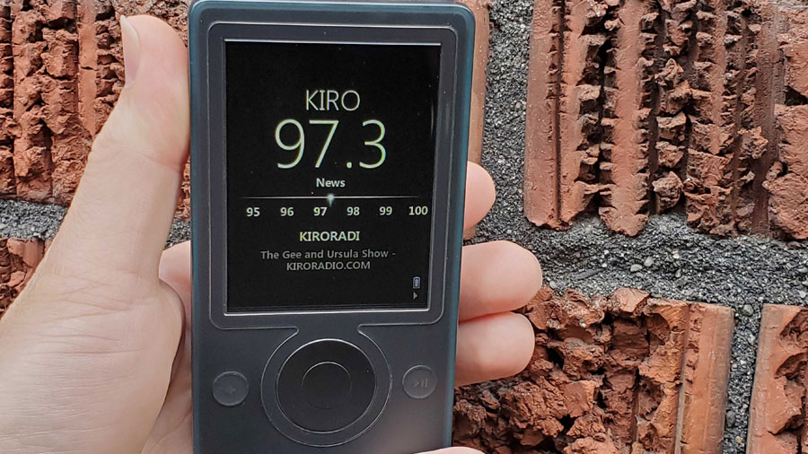

The Corso team is all about making sure that your data never goes away.
We've worked hard making the industry's only free and open-source tool for backing up Microsoft 365 data.
And that's why we're not letting anything from Microsoft die, certainly not 2006's best personal media player, the Zune.

…look, this all made sense when I bought the Zune and found someone to refurbish it. Just play along with me here, okay?

<!-- truncate -->

## A technology whose time has come

In many ways, the Zune was ahead of its time. Its wi-fi could stream music, and share your own media with other
Zunes on the local network.

It also, to my knowledge, was the first personal media player to come in brown. This Zune isn't brown, it's black,
but they did make brown ones.

*Look at that, brown. What a time to be alive.*

And not only can you load a Zune with MP3 or WMA files, but it's also got an FM radio.

*fm radio, certainly nothing will replace that*

This is a good thing since you'll have to run Windows Vista or earlier to load any media files onto the actual player.

## All right Nica, I can't possibly get more excited, how can I win this prize?

It will take you about 20 minutes. Just:

* [give Corso a try](https://corsobackup.io/docs/quickstart/)
* fill out the [Corso feedback form](https://forms.microsoft.com/r/mRVNKqeKDp)

That's it! If you do that I will hold a drawing in a few weeks, and send the lucky winner the working Zune that
I have on my desk at this moment.
