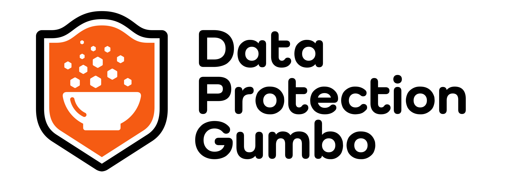

I recently sat down to talk with [Demetrius Malbrough](https://www.linkedin.com/in/backuprecoverypro/) on a recent
episode of his [Data Protection Gumbo podcast](https://dataprotectiongumbo.com/). We covered several topics related
to data protection for SaaS services in general and M365 specifically as well as the role of open source tools like
Corso can play to help secure this data. I have summarized some of the key discussion points below, but I highly
recommend listening to the [full episode](https://dataprotectiongumbo.com/184-exploring-microsoft-365-backup-and-recovery-alcion/).
Also, if you aren't following the podcast and Demetrius already, you should!
<!-- truncate -->

## Cloud adoption and security risks

We’ve been hearing and reading about companies moving to the cloud for the past decade, but in the wake of the COVID
pandemic and lockdowns, cloud migration has been truly accelerated. Remote workforce models and distributed teams are
here to stay, and adopting SaaS services has allowed companies to quickly accomplish this transition.

With a much more open network topology, properly securing and administering a myriad of SaaS services is a challenge,
and the risks increase as SaaS services become targets of malicious actors who recognize the business value of that data.

## SaaS data isn’t automatically safe

While many SaaS vendors publish their version of a shared responsibility model, it's not something that folks
naturally internalize. SaaS service customers often overestimate that the service availability and reliability
guarantees extend to full protection of customer data.

Unfortunately, this is more of an illusion. If access to a SaaS service is compromised, it will respond to malicious
traffic just as well as it would respond to legitimate requests. This makes some of the traditional defenses
(for example, service side encryption, data redundancy, etc) ineffective. With the increased adoption of SaaS services, we'll
see an increase in ransomware and other style attacks against them.

## Common attack vectors

Depending on the service, the initial attack vectors will typically be through direct credential leaks or, in more sophisticated
cases, through obtaining delegated access through phishing attacks. The result is that malicious actors obtain API-level
access to the targeted service.

From there actors can exfiltrate data and use the service APIs to client-side encrypt user data with keys that they
control. Depending on the privilege of the comprised credentials, the attackers can turn off access to native service
defenses. For example, in the case of Microsoft 365, a highly privileged account can manipulate and disable file
versioning settings before overwriting user data with encrypted content.

While we haven't seen a lot of these attacks publicized yet, I expect that will change as SaaS services become
priority targets.

## SaaS data protection considerations

First, acknowledge that SaaS data, such as M365 files, is of high business value and criticality (likely to include financial
models, operations plans, company IP, etc) and therefore it will be attacked.

Second, recognize that while helpful for traditional data protection scenarios like accidental deletion, SaaS service
native features (for example, previous versions and multi-level recycle bin) may not be sufficient to protect you against
all treats.

Third, determine your appetite for risk exposure when a breach occurs vs. the cost of a data protection solution.
Depending on your budget, you’ll have a choice to (A) accept the risk and rely on the level of protection offered by native
features (if they exist, higher licensing tier may be required) or (B) explore commercial data protection solutions.

If you like none of these options, you can also explore what might be available as Open Source tooling in this
domain, so that you can get establish at least a basic level of protection without directly incurring additional licensing
costs.

## Corso is a great open source option for M365

We at [Alcion](https://alcion.ai/) have discussed the topics above with a number of IT professionals from both SMBs
and the enterprise companies, and realized that the penetration of M365 data protection solutions is relatively low
compared to the importance of the data stored. This is due to a combination of overestimating Microsoft’s responsibility
for M365 customer data as well as budgetary considerations, especially on the smaller side of the SMB segment.

To raise awareness for the importance of M365 backups and lower the entry barrier, our team introduced
[Corso](https://corsobackup.io/) - a free, secure, and open-source backup solution for Microsoft 365. If you found my
conversation with Demetrius and the topics above interesting, give [Corso](https://corsobackup.io/) a try!
