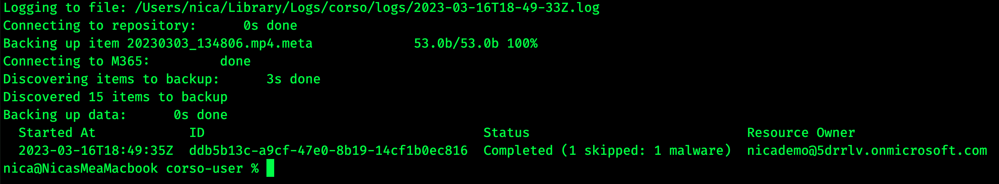
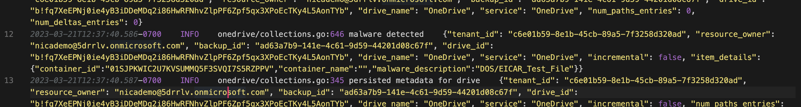

When we evaluate malware threats, we often think mainly of protecting our users.
The biggest concern is always going to be lost availability and leaked data if
malware affects our system. But like any threat with an infection model, part of
the story is about your responsibilities as an operations engineer to keep
others safe.
<!-- truncate -->

## Microsoft-hosted Malware

Research earlier in 2023 showed that Microsoft OneDrive was
[host to about 30% of all malware](https://www.cybertalk.org/2023/01/27/do-you-use-onedrive-or-google-drive-watch-out-for-this-malware/).
OneDrive is a popular platform for hosting malware because the malicious actor
can get a legitimate looking URL that will increase the chance of their payload
being downloaded or executed.

This malware hosting is usually done on accounts created by malicious actors,
but it's even more effective if an compromised account within a legitimate
organization can be used

The responsibility for addressing this issue lies more with administrators than
with Microsoft. Data on OneDrive is after all customer data so at the end of the
day MSFT it's not likely that MSFT will automatically start taking down files.  

Anyone running OneDrive and SharePoint should take measures to detect and remove malware - to protect their own users and the broader community

If you accept that using Microsoft OneDrive and 365 means that you should ‘be part of the solution’ how can you take a stand against malware?

## Scan for Malware

Sophisticated malware is difficult to engineer. Threats like BazarLoader, which
use a Trojan horse to create an ISO which waits for the user to open an
innocent-looking ‘Documents’ folder, aren’t being developed from scratch every
day. Therefore, it’s possible to scan for malware and find most threats before
they affect large numbers of systems.

While there are a number of tools to scan backups, attachments, and other file
locations, I’m pleased to say that Corso has implemented
[malware scanning for your backups as of V0.5.0](https://github.com/alcionai/corso/releases/tag/v0.5.0).
Corso aims to prevent content already flagged as malware from making it in your
backups. Since Corso is free and open-source, admins can take advantage of this
and take action (for example delete, extract for forensic analysis) against files
flagged by Corso.

## See it in Action: Create a Malware-Free Backup with Corso

We can hope that the first time you use a tool like Corso to scan your backups, you
have no malware detected. This however begs the question: how do we know it’s
working?

Good news: there are long-standing resources to grab ‘known bad’ files that
should set off any malware or virus scanner. The European Institute for Computer
Anti-Virus Research (EICAR) have made such a file available. With this rather
choice paragraph about why a non-virus ‘known bad’ file is useful for security
practices:

> Using real viruses for testing in the real world is rather like setting fire
> to the dustbin in your office to see whether the smoke detector is working.
> Such a test will give meaningful results, but with unappealing, unacceptable
> risks.

Download the EICAR test file here. Any scanner worth its salt will alert on at
least the first two versions of the file (`eicar.com` and `eicar.com.txt`) and
*should* notice malware inside a .zip as well. When using Corso with any of
these files, the feedback is quite clear:

Any detected files will be listed as 'skipped' and the rest of the backup will complete as normal.

## What to do when Corso Detects Malware

Files that Corso detects as malware will be skipped from backups, but you should
take steps to delete these files and do some analysis of their source within
your OneDrive instance. When Corso detects malware, it will log the fact
(Corso’s log location is displayed when the CLI runs).

Lines for detected malware will show up marked as `malware detected` and will even have a `malware_description` parameter.

## Monitor for new reports

The landscape for malware is shifting, and it’s vital you stay on top of new reports. Three sources of updates I’d recommend:
<!-- vale Vale.Spelling = NO -->
- [Microsoft’s Vulnerabilities Registry](https://msrc.microsoft.com/update-guide/vulnerability)
- [The Malwarebytes blog](https://www.malwarebytes.com/blog)
- [The Register’s tech news](https://www.theregister.com/), for a more industry-wide view of trends and major issues
<!-- vale Vale.Spelling = YES -->

If you keep these practices in place in your organization, not only are you less
likely to suffer from malware attacks, but the danger of your playing host to
malicious files and attacks on others will be greatly reduced!
