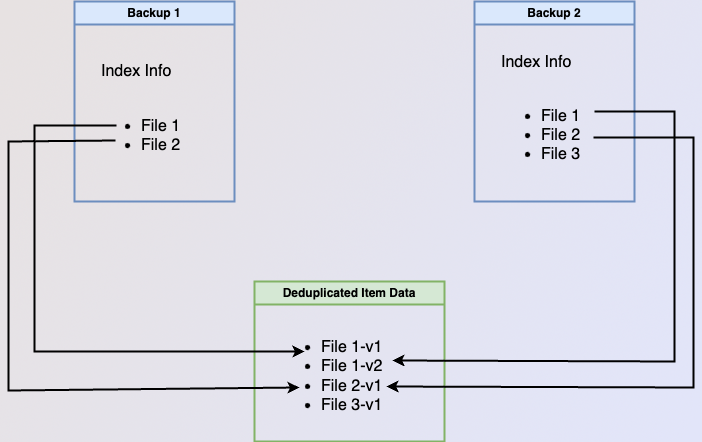

<!-- vale Vale.Spelling = NO -->

<!-- vale Vale.Spelling = YES -->

Full Microsoft 365 backups can take a long time, especially since Microsoft
throttles the number of requests an application can make in a given window of
time. Recent additions to Corso have reduced the duration of backups after the
first backup by taking advantage of Microsoft’s delta query API. Doing so allows
Corso to retrieve only the changes to the user’s data since the last backup
instead of having to retrieve all items with the Graph API. However,
implementing backups in this manner required us to play a few tricks with the
Corso implementation, so we thought we’d share them here.

<!-- truncate -->

## Background

Before we dive into the details of how incremental backups work, it’s useful to
have some knowledge of how delta queries work in the Microsoft Graph API and how
data is laid out in Corso backups.

### Microsoft delta queries

Microsoft provides a delta query API that allows developers to get only the
changes to the endpoint since the last query was made. The API represents the
idea of the “last query” with an opaque token that's returned when the set of
items is done being listed. For example, if a developer wants to get a delta
token for a specific email folder, the developer would first list all the items
in the folder using the delta endpoint. On the final page of item results from
the endpoint, the Graph API would return a token that could be used to retrieve
future updates.

All returned tokens represent a point in time and are independent from each
other. This means that getting token a1 at time t1, making some changes, and
then getting another token a2 at time t2 would give distinct tokens. Requesting
the changes from token a1 would always give the changes made after time t1
including those after time t2. Requesting changes from token a2 would give only
the changes made after time t2. Tokens eventually expire though, so waiting a
long time between backups (for example, a few days) may cause all items to be
enumerated again. See Nica's
[previous blog post on how backup frequency](https://corsobackup.io/blog/how-often-should-you-run-microsoft-365-backups)
can affect performance.

## Corso full backups, incremental backups, and backup layout

Before we get into the nuts and bolts of how Corso uses the Microsoft delta
query API, it’s important to first define what’s in a backup and the terminology
we’ll be using throughout this post.

### Kopia

Corso makes extensive use of [Kopia](https://github.com/kopia/kopia) to
implement our Microsoft 365 backup functionality. Kopia is a fast and secure
open-source backup/restore tool that allows you to create encrypted snapshots of
your data and save the snapshots to remote or cloud storage of your choice.

### Backup layout

Internally, a single Corso backup consists of three main parts: a kopia manifest
that Corso uses as the root object of the backup (BackupModel), a kopia index
for Corso, and a kopia data backup. The BackupModel contains summary information
about the status of the backup (did it have errors, how many items did it
backup, etc) and pointers to the two snapshots that contain information.

The kopia index contains the data output during a
`corso backup details` command and is used to filter the set of restored items
during restore commands. The index contains one entry for every backed up
Microsoft 365 item in the backup.

The data backup contains the raw bytes that Corso backed up from Microsoft 365.
Internally, Corso uses a file hierarchy in kopia that closely mirrors the layout
of the data in Microsoft 365. For example, if the user has a file in the OneDrive folder
`work/important` then Corso creates a kopia path
`<tenant ID>/onedrive/<user ID>/files/<drive ID>/root/work/important` for that
file.

Corso also stores a few extra bits of metadata in the data snapshot to help with
incremental backups. Most importantly, it stores the Graph API’s delta tokens
retrieved during the backup process as well as a mapping relating the current
Microsoft 365 folder IDs to their paths. This information is stored with
different path prefixes (ex. uses `onedriveMetadata` instead of `onedrive`) to
make it straightforward to separate out from backed up item data.

### Terminology

*Full backups* are backups where all of the data being backed up is fetched from
Microsoft 365 with the Graph API. These backups may take a long time to complete (we’ve
seen backups of accounts with extremely large amounts of data run for 20+ hours) due to throttling imposed by Microsoft 365.
For the purposes of this blog, *incremental backups* are backups where Corso
fetches only a subset of items from Microsoft 365. Ideally Corso would fetch only the
items that change, though there may be reasons it needs to fetch more data.

Whether Corso does a full backup or an incremental backup, the resulting Corso
backup has a listing of all items stored in Microsoft 365 (what we refer to as *indexing
information*). This means there’s no “chaining” between backups and restoring an
item from a backup requires only accessing information contained in or
referenced directly by the backup passed in to the restore command. This makes
backups independent from each other once they’ve been created, so we’ll refer to
them as *independent backups* for the rest of this post.

Both independent backups and chained backups have the same information. Having
independent backups generally creates more complexity when making a new backup
while chained backups generally have more complexity during restore and backup
deletion. Independent backups have more complexity when creating the backup as
indexing information and item data references for deduplicated data may need to
be sourced from previous backups. Chained backups have more complex restore as
multiple backups may need to be searched for the item being restored. They also
have more complex backup deletion as an item’s data can only be deleted if no
backups in any chain refer to it. The figure below gives a high-level overview
of the differences between independent backups and chained backups.

*both images below show how data would be stored if the user backed up two files on their first backup and then made a*
*new file and updated file1 before taking a second backup*

*both images below show how data would be stored if the user backed up two files on their first backup and then made a*
*new file and updated file1 before taking a second backup*

Although having a full listing of all items present at the time of the backup in
each backups sounds wasteful, Corso takes advantage of the data deduplication
provided by kopia to only store one copy of the underlying bulk data in the data
snapshot for backed up items. What this really means is each Corso backup has a
complete set of *indexing information*. This gives Corso the best of both
worlds; allowing completed backups to have independent indexing information and
life cycles from each other while still minimizing the amount of item data
stored.

Understanding how Microsoft provides information on item updates is a key part
of Corso's ability to provide fast, high-performance backups that still
accurately reflect all updates. If you have feedback, questions, or want more information, please join us on the [Corso Discord](https://discord.gg/63DTTSnuhT).

> 💡 In
> [part 2 of our series](../incremental-backups-pt2/),
> we’ll cover Incremental backups in action, and how Corso manages state and
> merges updates to the hierarchy.

---

## Try Corso Today

Corso implements compression, deduplication *and* incremental backups to give
you the best backup performance. Check
[our quickstart guide](https://corsobackup.io/docs/quickstart/) to see how to get started.
