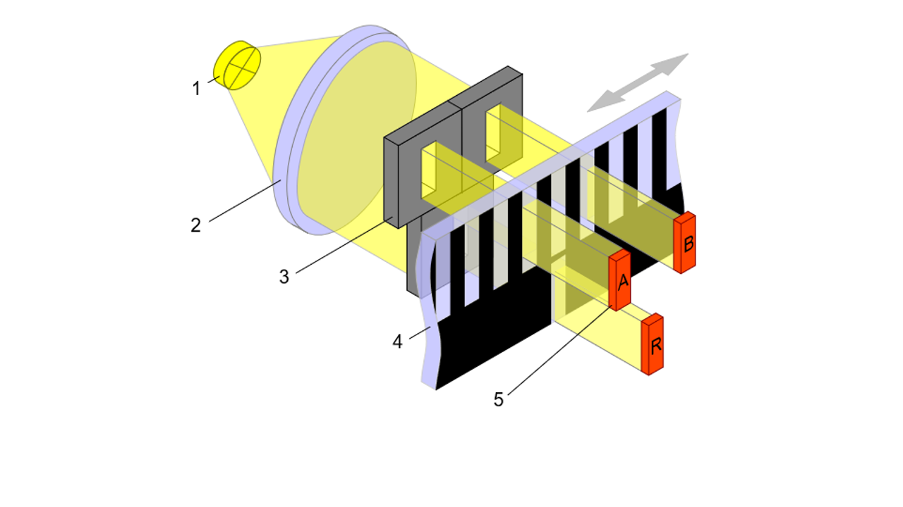

<!-- vale Vale.Spelling = NO -->


<!-- vale Vale.Spelling = YES -->

In [part 1](../incremental-backups-pt1) we discussed how there’s more than
one way to run backups, and how full and incremental backups differ.

With all the background information out of the way, it’s time to see how
incremental backups actually come together in Corso. To do this, we’ll discuss
things in the context of a running example.
<!-- truncate -->
## Part 1: Starting state

Let’s say that Corso has previously run a backup for a user’s OneDrive. At the
time of the backup, the drive had a layout like the below when listing all items
in the root folder:

```JSON
- folder1 (directory, ID: 1)
  - super secret file1.txt (file, ID: 2)
  - temp.log (file, ID: 3)
- folder2 (directory, ID: 4)
  - secret file.docx (file, ID: 5)
- folder3 (directory, ID: 6)
  - static file.docx (file, ID: 7)
- folder4 (directory, ID: 8)
	- plain file.txt (file, ID: 9)
	- folder5 (directory, ID: 10)
		- update.log (file, ID: 11)
```

The corresponding Corso backup would have the following items in the kopia item
data snapshot (some prefix folders elided for brevity and file/folder names use
directly for clarity):

```JSON
- onedrive
	- root
	  - folder1
	    - super secret file1.txt
	    - temp.log
	  - folder2
	    - secret file.docx
		- folder3
			- static file.docx
		- folder4
			- plain file.txt
			- folder5
				- update.log
- onedriveMetadata
  - folderMap.json (provides mapping of folder IDs to paths)
  - delta.json (provides delta tokens for endpoints)
```

Since this post is all about fetching only the changes since the last backup,
let’s also assume that between the time of the last backup and now the user has
done the equivalent to the following commands in their OneDrive:

```
rm -rf root/folder2 (directory subtree deletion)
mkdir root/folder2 (directory creation)
touch root/folder2/new secret file.txt (file creation)
echo "hello world" >> root/folder1/super secret file1.txt (file update)
rm root/folder1/tmp.log (file deletion)
mv root/folder4 root/folder1 (make directory subdirectory of another)
```

After the above commands are run, the layout in OneDrive looks like (again, listing all items in the root folder)

```JSON
- folder1 (directory, ID: 1)
  - super secret file1.txt (file, ID: 2)
	- folder4 (directory, ID: 8)
		- plain file.txt (file, ID: 9)
		- folder5 (directory, ID: 10)
			- test.log (file, ID: 11)
- folder2 (directory, ID: 12)
  - new secret file.docx (file, ID: 13)
- folder3 (directory, ID: 6)
  - static file.docx (file, ID: 7)
```

## Part 2: Finding the last backup

Now, the user runs `corso backup create onedrive` . The first thing Corso will
do is find the most recently completed backup for OneDrive (call it the *base
backup* for this operation) for the user being backed up and load the
`folderMap.json` and `delta.json` files from it. `folderMap.json` contains the
mapping of folder IDs to paths and will help Corso determine how the folder
hierarchy evolved between the backups. `delta.json` contains all delta token(s)
that the previous backup generated. These will be used to fetch only the changes
by sending them to Microsoft’s delta endpoints.

OneDrive has a single delta endpoint per drive, so the `delta.json` file
contains only a single opaque delta token. The data in `folderMap.json` contains
all folders that were in the previous backup, so it would look like

```JSON
- ID1: root/folder1
- ID4: root/folder2
- ID6: root/folder3
- ID8: root/folder4
- ID10: root/folder4/folder5
```

## Part 3: Getting and organizing changes

With the delta token in hand, Corso can request Microsoft send it changes since
the last backup. Sending the token to the Microsoft endpoint would yield results
like the following:

```JSON
{
	{
		id: 3,
		deleted: true,
		parentPath: "/root",
	},
	{
		id: 4,
		deleted: true,
		type: folder,
		parentPath: "/root",
	},
	{
		id: 5,
		deleted: true,
		type: file,
		parentPath: "/root",
	},
	{
		id: 1,
		name: "folder1",
		type: folder,
		parentPath: "/root",
	},
	{
		id: 2,
		name: "super secret file1.txt",
		type: file,
		parentPath: "/root/folder1",
		parentID: 1
	},
	{
		id: 8,
		name: "folder4",
		type: folder,
		parentPath: "/root/folder1",
		parentID: 1
	},
	{
		id: 12,
		name: "folder2",
		type: folder,
		parentPath: "/root",
	},
	{
		id: 13,
		name: "new secret file.txt",
		type: file,
		parentPath: "/root/folder2",
		parentID: 12,
	},
}
```

Some high-level things to note about the returned results are:

- deleted OneDrive items don’t show the path they used to reside at but do show if something was a folder or a file
- a new version of “folder2” was created. It has the same name and `parentPath` as the previous version but a different ID
- both folders and files are returned in the same request
- Graph API always returns all returns ancestor folders for an item before the
  item itself. Folders are returned in the order of the hierarchy (i.e.
  `[root, folder1, ...]`)
- items in a deleted folder are also returned as deleted
- `folder3` and its items isn’t returned because nothing in that subtree was
  changed
- moving a folder subtree only returns a result for the root of the subtree
  unless other items in the subtree were individually updated (e.x. no result
  was returned for `folder5` even though it was moved)

For every returned item, Corso checks if it’s a folder or a file and reacts accordingly.

### Handling folders

Folders have an in-memory representation of a Collection during a backup. This
helps Corso group items together and allows Corso to express hierarchy changes
the folder may have participated in.

Every Collection has a current and previous path, representing where the folder
is in the hierarchy now and where the folder was in the previous backup. The
current path is sourced from the returned results; it can be generated by
appending the name of an item to the `parentPath` of the item. Folders that have
been deleted have their current path set to an empty value.

The previous path is found by looking up the folder’s ID in the `folderMap.json`
data from the previous backup. Since that map is indexed by ID, it can still
find folders that have been deleted or folders that have been renamed. Folders
that weren't in the previous backup (created between when the last backup
completed and this backup started) have their previous path set to an empty
value.

Together, the values of the current and previous paths allow Corso to represent
a set of changes to the hierarchy in an order-independent fashion. That means
the Collections always represent the same set of changes no matter what order
other components of Corso see the Collections in. The “state” of a Collection
can always be determined by comparing the values of the two paths. The table
below shows the different possible states.

| Previous Path | Current Path | State |
| --- | --- | --- |
| any value | empty | deleted folder |
| empty | any value | new folder |
| different from current | different from previous | folder moved |
| same as current | same as previous | no change |

To see where this representation and order-independence really comes in handy,
consider the case of `folder2`. Between the backups the original `folder2` and
all it’s items was deleted and a new folder with the same path was created with
a new item. From the user’s perspective and if potential differences in
permissions are ignored, there’s not really a difference between the old and new
`folder2`s. The items they have may be different, but the user generally doesn’t
inspect the M365 IDs of folders, so the fact that they reside at the same
location and have the same name makes them the “same” in some sense.

However, Corso shouldn’t treat the old and new folders as the same as it could
lead to propagating old information instead of new information (e.x. consider
folder permissions, which aren’t discussed here but which users will eventually
be able to backup). To distinguish between the two, Corso will create two
Collections with different states. Let’s say the first Collection created
represents the deleted folder. It will have an empty current path and a previous
path equal to `/root/folder2`. The second Collection will have the opposite: a
current path of `/root/folder2` and an empty previous path. By having two
Collections, Corso can distinguish between the two versions of `folder2` and
take the appropriate action for each.

### Handling files

Every file in the results is added to the Collection representing the folder
containing the item. Which Collection to add the item to can be discovered with
the `parentID` field that's set on every item in the result (root’s ID not show
in the example). Fetching the actual item data is done later when Corso actually
uploads with to kopia.

Since deleted and moved files don’t denote where they used to reside, every item
is also added to a list of item names to “exclude” from the previous backup
later on. Tracking this list ensures Corso doesn’t duplicate items or create
*zombie items:* items that stick around in the backup even after the user
deletes them in M365. If the old location of the item is known, then Corso can
just add an entry in the corresponding Collection saying the item was deleted
(this is how Exchange works as it has a delta endpoint per folder).

### Putting it all together

At the end of this part, Corso has processed all delta results and created a set
of Collections with items. In the running example we’ve been discussion, Corso
will create the following Collections:

```JSON
collections: [
	{
		currentPath: "",
		previousPath: "/root/folder2",
		itemIDs: [],
	},
	{
		currentPath: "/root/folder1",
		previousPath: "root/folder1",
		itemIDs: [super secret file1.txt (ID: 2)],
	},
	{
		currentPath: "/root/folder2",
		previousPath: "",
		itemIDs: [new secret file.txt (ID: 13)],
	},
	{
		currentPath: "/root/folder1/folder4",
		previousPath: "/root/folder4",
		itemIDs: [],
	},
]

excludeItemIDs: [2, 3, 5, 13]
```

## Part 4: Merging hierarchies in kopia

Graph API can give Corso the changes since the last backup, but there’s still a
problem: kopia requires that all items that should appear in a snapshot be given
to kopia at the time the snapshot is created. In essence, kopia won't
automatically merge data from previous snapshots into the current snapshot. This
is problematic because if Corso passed only the set of changed items the Graph
API returned it would create a snapshot representing only those changes and a
lookup in the previous backup would be required to return information about
unchanged items. That would require Corso to implement chained backups instead
of independent backups.

Corso works around this by *merging* the set of updated Collections with the
folder hierarchy in the base backup. Merging hierarchies is concerned with
getting Collections and folders in the correct locations, and assumes that items
will land in the right place as long as the containing Collection or folder
does.

Merging hierarchies is done in two steps: first Corso builds an in-memory tree of the non-deleted Collections created from Graph API results and then Corso walks the base backup and adds folders from there to the in-memory tree.

### Collections

The first step is mostly straightforward, though Corso does keep some addition
metadata to help with deletions, moves, and renames of folders in the backup.

The in-memory tree Corso creates has a node for every folder in the current path
for each Collection even if there’s no Collection for that folder. Creating a
consistent in-memory layout like this makes it easier to inform kopia of the
complete hierarchy when it comes to actually uploading data. Tree nodes that do
correspond to a Collection contain a reference to the Collection. For example,
the tree node for `root` won’t have a Collection reference because no Collection
was made for it. The tree node for `root/folder1` will have a Collection
reference though as earlier parts made a Collection for it. At the end of the
first step of hierarchy merging, Corso will have the following information
in-memory.

```JSON
tree representation:
- root (no Collection)
	- folder1 (Collection)
		- folder4 (Collection)
	- folder2 (Collection)

extra metadata about changed paths, maps from old path
to new where "" means deleted:
{
	"/root/folder2": "",
	"/root/folder4": "/root/folder1/folder4",
}
```

### Base backup entries

The next step fills in the “unchanged” information by adding references to base
backup directories to the in-memory tree (I say “unchanged” because it does
include things like unmodified files that got moved when the file’s parent
folder moved). Recall that the base backup had the following layout in kopia:

```JSON
- onedrive
	- root
	  - folder1
	    - super secret file1.txt
	    - temp.log
	  - folder2
	    - secret file.docx
		- folder3
			- static file.docx
		- folder4
			- plain file.txt
			- folder5
				- update.log
- onedriveMetadata
  - folderMap.json (provides mapping of folder IDs to paths)
  - delta.json (provides delta tokens for endpoints)
```

For the merging step, Corso is interested only in the subtree rooted at
`onedrive/root` as the metadata will be replaced completely with new metadata.
Corso traverses the base backup in a depth-first manner and, for every folder it
will determine the answer to the following questions:

1. has the folder been explicitly renamed, moved, or deleted?
2. is the folder a descendant of a deleted folder?
3. is the folder a descendant of a folder that was renamed or moved?

These questions can be answered by getting the path of the folder in the base
backup, dynamically generating the expected path of the folder in the current
backup based on any changes that may have happened to ancestors of the folder,
and checking the metadata Corso set aside in the previous step.

The first check handles folder renames, moves, and deletions by seeing if
there’s a metadata map entry for the folder’s base backup path. The second and
third checks use dynamically generated expected paths to implement operations
that act on subtrees of the hierarchy instead of individual folders. Moving
`folder4` to be a subfolder of `folder1` (and `folder5` to be a subsubfolder of
`folder1` ) is an example where these subtree operations are needed.

The order Corso processes these checks is important. For example, reversing the
first and second check will result in mistakenly deleting folders that were
moved prior to deleting the parent of the folder (e.x.
`mv /root/folder4/folder5; rm -rf /root/folder4`) because Corso will see the
folder is a descendent of something that was deleted and think it should be
deleted as well.

When augmenting the in-memory tree, folders that are marked as deleted don't
have their reference added to a tree node. Folders that were moved or renamed
have their reference added to the tree node where the folder resides in the
currently running backup.

To give a concrete example of how this would work, let’s look at how Corso would
process `folder4` and `folder5` from the base backup. When Corso reaches
`folder4` in the base backup, it generates the base backup path `/root/folder4`
, an expected path of `/root/folder4` (no ancestors of `folder4` changed), and
checks to see if the base backup path exists in the metadata map. Corso finds
the updated path `/root/folder1/folder4` in the metadata map which represents
the new path `folder4` should reside at. Since the metadata map shows `folder4`
still exists in the currently running backup, a reference to the base backup’s
`folder4` is added to the in-memory tree node for that folder.

Next, Corso processes the subfolders of `folder4`, in this case `folder5`. At
this point `folder5` has a base backup path of `/root/folder4/folder5` and an
expected path of `/root/folder1/folder4/folder5` . As no entry for
`/root/folder4/folder5` is found in the metadata map, the expected path is used
and a new in-memory tree node for `folder5` is created with a reference to the
base backup’s `folder5`.

By the end of merging, the in-memory tree that Corso’s building has the layout
shown below. The additional in-memory metadata map that was created in the first
step of merging can be discarded as it’s no longer needed.

```JSON
tree representation:
- root (no Collection, base backup directory)
	- folder1 (Collection, base backup directory)
		- folder4 (Collection, base backup directory)
			- folder5 (base backup directory)
	- folder2 (Collection)
	- folder3 (base backup directory)
```

## Part 5: Merging items in folders and uploading data

Once the in-memory tree of the folder hierarchy is created Corso can finally
begin uploading items to S3 with kopia. This is done by starting a kopia
snapshot with the in-memory tree as the “file system” hierarchy to backup. When
each folder in the hierarchy is read by kopia, Corso first passes kopia the set
of items in the Collection for the folder, if a Collection is present. Items
sourced from a Collection also have their IDs tracked by Corso so it can exclude
those items when reading from the base backup’s folder if one a reference is
present.

Once all the items in the Collection have been given to kopia, Corso begins
giving kopia entries from the base backup folder if there’s one associated with
the in-memory tree node. While doing this, Corso checks each item in the base
backup folder to see if it matches either the exclude list generated in part 3
or an item that was streamed from the Collection. Filtering out these items has
the effect of “deleting” that copy of them from the current backup. If these
items weren’t filtered out then the Corso backup would either have duplicate
items (if the item was updated or moved between directories) or have *zombie
items* (if the item was deleted). Items from the base backup that are actually
included in the current backup are tracked so Corso can also retrieve their
indexing information in the next part.

Data for items is pulled from M365 using the Graph API when kopia actually needs
to upload the data to S3. By lazily fetching data, Corso avoids making Graph API
requests if kopia already has a copy of that item’s data. It also reduces the
memory footprint of Corso because only a few items’ data needs to be in memory
at any given point in time.

Going back to our running example, the folder merge operation for `folder1` would proceed as follows:

```JSON
// starting state
global exclude items: [
	super secret file1.txt (ID: 2),
	tmp.log (ID: 3),
	secret file.docx (ID: 5),
	new secret file.docx (ID 13),
]
local exclude items: []

// items from Collection
super secret file1.txt (ID: 2) // uploaded, add to local exclude items

// new state
global exclude list: [
	super secret file1.txt (ID: 2),
	tmp.log (ID: 3),
	secret file.docx (ID: 5),
	new secret file.docx (ID 13),
]
local exclude items: [super secret file1.txt (ID: 2)]

// items from base backup
super secret file1.txt (ID: 2) // skipped because it's in local exclude items
temp.log (ID: 3) // skipped because it's in the global exclude items
```

By the end of this part, Corso has also collected references for all items
sourced from the base backup. The references that Corso tracks helps it map from
the old location of the item to the new one as shown below.

```JSON
items from base backup: [
	/root/folder3/static file.docx => /root/folder3/static file.docx
	/root/folder4/plain file.txt => /root/folder1/folder4/plain file.txt
	/root/folder4/folder5/update.log => /root/folder1/folder4/folder5/update.log
]
```

## Part 6: Merging indexing information and persisting the Backup model

The final thing Corso needs to do is merge the set of updated indexing
information with indexing information from the base backup. Merging the two
allows Corso to filter backup details and restore inputs down to just the
selected items without having to traverse multiple backups to find all the
information.

To merge indexing information, Corso first loads the indexing information from
the base backup. Then, it compares the entries in the base backup’s index with
the set of references collected in the previous part. Entries that match are
updated if needed (the item’s location in OneDrive may have changed) and
added to the new set of indexing information for the current backup.

Once the indexing information has been merged all data for the backup is
complete except the BackupModel that acts as the root reference for the backup.
The backup model summarizes what happened in the backup and contains references
to the index information and the item data snapshot so they can be found later.
The model itself is also stored in kopia so it’s data is encrypted as well. Once
the BackupModel is added to kopia the Corso backup is considered complete and
can be used for future restores.

---

## Try Corso Today

Corso implements compression, deduplication *and* incremental backups to give
you the best backup performance. Check
[our quickstart guide](https://corsobackup.io/docs/quickstart/) to see how
quickly you can get started.
