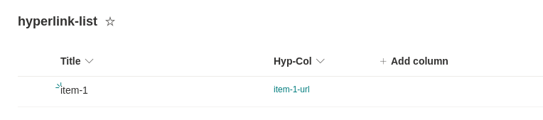
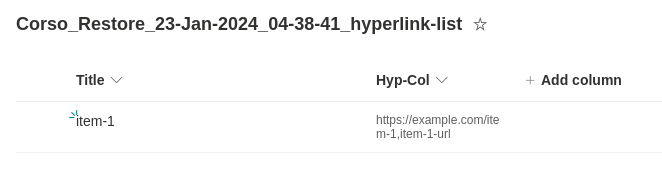
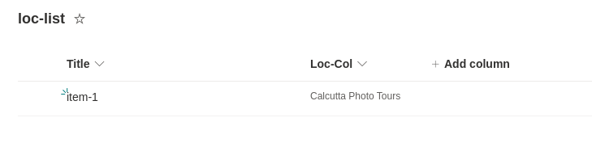
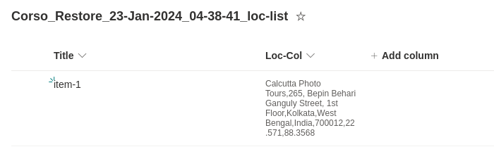

# Bugs and new features

import Tabs from '@theme/Tabs';
import TabItem from '@theme/TabItem';

You can learn more about the Corso roadmap and how to interpret it [here](https://github.com/alcionai/corso-roadmap).

If you run into a bug or have feature requests, please file a [GitHub issue](https://github.com/alcionai/corso/issues/)
and attach the `bug` or `enhancement` label to the issue. When filing bugs, please run Corso with
`--log-level debug --hide-progress --mask-sensitive-data` and add the logs to the bug report. You can find more
information about where logs are stored in the [log files](../../setup/configuration/#log-files) section in setup docs.

## Memory Issues

Corso's memory usage depends on the size of the resource being backed up. The maximum memory usage occurs during full
backups (usually the first backup) vs. later incremental backups. If you believe Corso is using unexpected amounts of
memory, please run Corso with the following options:

- Prefix the Corso run with `GODEBUG=gctrace=1` to get GC (Garbage Collection) logs
- Add `--log-level debug --hide-progress --mask-sensitive-data`
- Redirect output to a new log file (for example, `corso-gc.log`)

<Tabs groupId="os">
<TabItem value="win" label="Powershell">

  ```powershell
  # Connect to the Corso Repository
  GODEBUG=gctrace=1 .\corso <command> -hide-progress --log-level debug --mask-sensitive-data `
    <command-options> > corso-gc.log 2>&1
  ```

</TabItem>
<TabItem value="unix" label="Linux/macOS">

  ```bash
  # Connect to the Corso Repository
  GODEBUG=gctrace=1 ./corso <command> -hide-progress --log-level debug --mask-sensitive-data \
    <command-options> > corso-gc.log 2>&1
  ```

</TabItem>
</Tabs>

Next, file a [GitHub issue](https://github.com/alcionai/corso/issues/) with the two log files
([default log file](../../setup/configuration/#log-files) and `corso-gc.log`, the Corso GC log file, from above) and
information on the size of the Exchange mailbox, OneDrive location, or SharePoint site that you are having an issue
with.

## Sharepoint List Anomalies

Here is an example of GRPAH API response of columns of a list:

```json
[
  {
    "columnGroup": "Custom Columns",
    "description": "",
    "displayName": "ISBN",
    "enforceUniqueValues": false,
    "hidden": false,
    "id": "fa564e0f-0c70-4ab9-b863-0177e6ddd247",
    "indexed": false,
    "name": "Title",
    "readOnly": false,
    "required": false,
    "text": {
      "allowMultipleLines": false,
      "appendChangesToExistingText": false,
      "linesForEditing": 0,
      "maxLength": 255
    }
  }
]
```

This column is recognizable to be a `text` column from the response.

Some columns in sharepoint list aren't recognizable from the GRAPH API response.
Therefore while `restore` of these columns, we default them to as text fields.
The value they hold are therefore not reinstated to the way the originally were.

<Tabs groupId="columns">
<TabItem value="hyp" label="Hyperlink">

### Originally created hyperlink column in Site



### GRAPH API response for the hyperlink column

```json
[
  {
    "columnGroup": "Custom Columns",
    "description": "",
    "displayName": "Hyp-Col",
    "enforceUniqueValues": false,
    "hidden": false,
    "id": "1b30f675-1316-498c-a5f1-901bca2d5470",
    "indexed": false,
    "name": "Hyp_x002d_Col",
    "readOnly": false,
    "required": false
  }
]
```

### GRAPH API response for the item data with hyperlink column

```json
{
  "Title": "item-1",
  "Hyp_x002d_Col": {
    "Description": "item-1-url",
    "Url": "https://example.com/item-1"
  }
}
```

### Restored hyperlink column



### Issue tracker for hyperlink column support

To track progress, see <https://github.com/microsoftgraph/msgraph-sdk-go/issues/640>.

</TabItem>
<TabItem value="loc" label="Location">

### Originally created location column in Site



### GRAPH API response for the location column

```json
[
  {
    "columnGroup": "Custom Columns",
    "description": "",
    "displayName": "Loc-Col",
    "enforceUniqueValues": false,
    "hidden": false,
    "id": "85df986d-e844-4bd5-bcf1-dd62d4c39a39",
    "indexed": false,
    "name": "Loc_x002d_Col",
    "readOnly": false,
    "required": false
  }
]
```

### GRAPH API response for the item data with location column

```json
{
    "Title": "item-1",
    "Loc_x002d_Col": {
        "address": {
            "city": "Kolkata",
            "countryOrRegion": "India",
            "postalCode": "700012",
            "state": "West Bengal",
            "street": "265, Bepin Behari Ganguly Street, 1st Floor"
        },
        "coordinates": {
            "latitude": 22.571,
            "longitude": 88.3568
        },
        "displayName": "Calcutta Photo Tours",
        "locationUri": "https://www.bingapis.com/api/v6/localbusinesses/YN4070x16441674068003643871",
        "uniqueId": "https://www.bingapis.com/api/v6/localbusinesses/YN4070x16441674068003643871"
    },
    "CountryOrRegion": "India",
    "State": "West Bengal",
    "City": "Kolkata",
    "PostalCode": "700012",
    "Street": "265, Bepin Behari Ganguly Street, 1st Floor",
    "GeoLoc": {
        "latitude": 22.571,
        "longitude": 88.3568
    },
}
```

### Restored location column



### Issue tracker for location column support

To track progress, see <https://github.com/microsoftgraph/msgraph-sdk-go/issues/638>.
</TabItem>
</Tabs>
